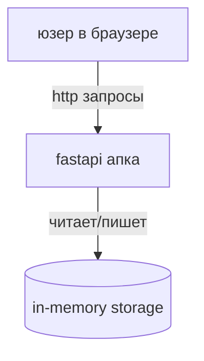
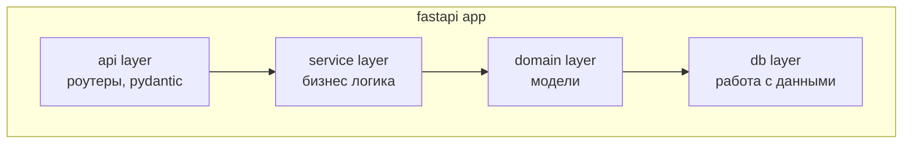

# домашняя работа по разработке продукта

## 1. концепция продукта

### идея продукта
сервис для заметок - простая апка для создания и хранения текстовых заметок. юзеры могут создавать заметки с заголовком и текстом, смотреть список заметок.

### жизненный цикл продукта

**этап 1: идея и планирование (1-3 дня)**
- определили что будем делать
- посмотрели на аналоги типа notion
- сделали требования и архитектуру

**этап 2: разработка mvp (8 часов)**
- делаем базовый api
- пишем код по слоям
- тесты
- документация

**этап 3: тестирование (1 час)**
- unit тесты и интеграционные
- фиксим баги
- проверяем что норм работает под нагрузкой

**этап 4: запуск (1-2 дней)**
- деплоим на сервер
- настраиваем мониторинг
- пишем инструкцию для юзеров

**этап 5: поддержка и развитие (постоянно)**
- следим чтобы все работало
- чиним баги
- добавляем новые фичи

### ключевые требования

**функциональные:**
- создание заметки
- получение заметки по id
- список всех заметок
- rest api

**нефункциональные:**
- api должен отвечать быстро (до 200ms)
- доступность 99%
- легко масштабировать
- чистый код

**технические:**
- python 3.13
- fastapi
- слои в коде
- покрытие тестами 70%+

### ddd контексты

**основной контекст: notes management**
управление заметками

сущности:
- note - id, title, content, created_at

**внешние контексты:**

1. **user context** (потом добавим)
   - авторизация юзеров
   - привязка заметок к юзерам

2. **storage context**
   - хранение данных
   - сейчас in-memory
   - потом можно postgres подключить

3. **notification context** (в будущем)
   - уведомления об изменениях
   - напоминания

## 2. архитектура

### тип: монолит

**почему монолит:**
для простой апки заметок выбрал монолит потому что проще разрабатывать на старте. не нужна сложная инфраструктура между сервисами. если потом будет много юзеров можно разделить на микросервисы.

**плюсы:**
- быстро делать mvp
- легко деплоить
- проще отлаживать

**минусы:**
- сложнее масштабировать отдельные части
- если код разрастется будет тяжело поддерживать

### c4 диаграммы

#### container diagram



**компоненты:**
- юзер - пользователь через браузер или postman
- fastapi апка - основное приложение
- in-memory storage - данные в памяти (для mvp)

#### component diagram



**слои:**
1. api layer - эндпоинты, валидация запросов
2. service layer - бизнес логика
3. domain layer - доменные модели
4. db layer - работа с хранилищем

## 3. практика с fastapi

реализовал прототип с разделением на слои

**структура:**
```
src/notes_service/
├── api/          # роутеры
├── service/      # логика
├── domain/       # модели
├── db/           # база
└── main.py       # запуск
```

**эндпоинты:**
- POST /notes - создать заметку
- GET /notes/{note_id} - получить заметку

**конвертация моделей:**
pydantic (api) → domain модели → db модели

**observability:**
добавил комментарии где можно прикрутить:
- логи (в сервисах)
- метрики (сколько заметок создали, время операций)
- трейсинг (отслеживание запросов)

**тесты:**
unit тесты для service и api слоев

## 4. scrum

### user stories

**story 1: создание заметки**
как юзер хочу создать заметку чтобы сохранить инфу

приемка:
- post запрос с title и content
- возвращается заметка с id
- title обязателен

**story 2: просмотр заметки**
как юзер хочу получить заметку по id чтобы прочитать ее

приемка:
- get запрос с id
- возвращается заметка
- если нет заметки то 404

**story 3: список заметок**
как юзер хочу видеть все заметки чтобы найти нужную

приемка:
- получить список всех заметок
- список может быть пустой
